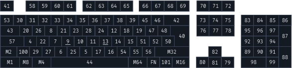

# Fobword

Fobword is a portable password manager.
The project is designed for the Nanopi Neo with OLED screen, where it will sit between the keyboard and the computer.

### Commands

| Command    | Description                            | Inputs in order                                         |
|------------|----------------------------------------|---------------------------------------------------------|
| New        | Create a new macro                     | Name, Password, Hint, Comment                           |
| Generate   | Generate a password from constraints   | Name, Password length, Password symbols, Comment        | 
| Regenerate | Regenerate a password from constraints | Name, Password length, Password symbols, Comment        |
| Update     | Update an existing macro               | Name, Password, Hint                                    |
| Delete     | Delete an existing macro               | Name, Name                                              |
| Save       | Save the changes made                  | Main program password                                   |
| Hint       | Print the Hint of the macro            | Name                                                    |
| Comment    | Print the Comment of the macro         | Name                                                    |
| Change     | Change the main password               | Old main password, New main password, New main password |
| Lock       | Lock the program                       |                                                         |

## Keymaps

Fobword is by default qwerty but supports custom mapping.    
It works by internally mapping a custom layout to qwerty, so no changes need to be made on the host computer. 
The default is based on the official [USB document](https://usb.org/sites/default/files/hut1_22.pdf#page=83). 
The numbers of the keys map to a qwerty keyboard like this:

The layout is formatted as (Key, (Modifier, Key number))
[qwerty](qwerty-layout.txt)

If you want to use a custom map, you have to create a new layout and edit the settings value 'input map' to the name of your layout.

## License

Licensed under [MPL License Version 2.0](https://www.mozilla.org/en-US/MPL/2.0/)

See [here](https://www.mozilla.org/en-US/MPL/2.0/FAQ/) for the License FAQ
